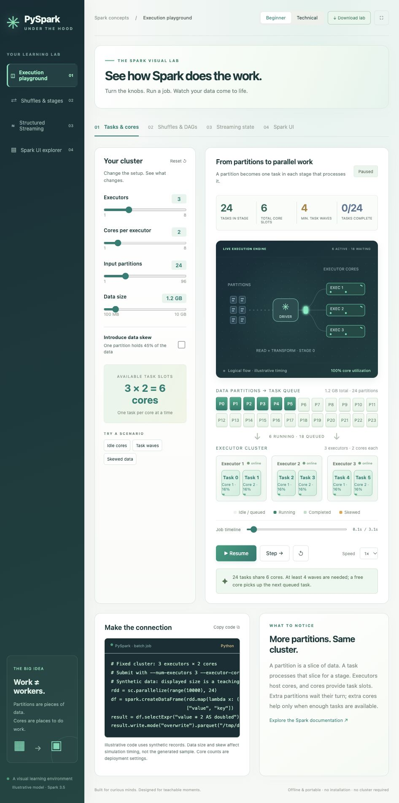

# PySpark Under the Hood

An interactive visual lab for Spark execution, shuffles, and stateful streaming. Runs offline in your browser. No installation, account, server, or Spark cluster required.

## Try it in your browser

**[Download the offline lab ZIP](https://github.com/GauravSinha-SDE/pyspark-under-the-hood/releases/download/v1.0.0/PySpark-Under-the-Hood-Offline.zip)** · **[Download the single HTML file](https://github.com/GauravSinha-SDE/pyspark-under-the-hood/releases/download/v1.0.0/index.html)**

Open the downloaded HTML in your browser. If you use the release ZIP, extract it and open `PySpark Under the Hood.html`.

Or download the complete source repository:

1. Click **Code → Download ZIP** above.
2. Extract the ZIP.
3. Double-click **index.html**, or use **Open With** to select your browser.

The regular GitHub repository page displays the source code; it does not run the lab. After downloading, the lab runs entirely in your browser.

You can also open `index.html` on GitHub and use **Download raw file** to save just that file. All required JavaScript and CSS are embedded in it.

## Explore

- **Tasks & cores:** change executors, cores per executor, partitions and data size. Follow animated task packets from partitions through the driver to executor cores.
- **Shuffles & DAGs:** explore `repartition()`, `spark.sql.shuffle.partitions`, shuffle exchanges, stage boundaries and the DAG.
- **Streaming state:** compare 200 and 800 state partitions while keeping the executor and core counts unchanged.
- **Spark UI:** connect task progress, core utilization and timelines to a simplified Spark UI.

Use Run, Pause, Step and the draggable Job timeline. Try Idle cores, Task waves or Skewed data. Beginner mode uses plain-language explanations; Technical mode adds scheduler assumptions and checkpoint constraints. The expand button hides the sidebar for teaching.

## Model assumptions

This is an illustrative Spark 3.5 model, not a performance benchmark. Executors are fixed, tasks require one core each, and AQE, retries, failures and speculation are omitted. Waves are a lower bound; free cores independently schedule queued tasks. Timing is synthetic.

The skew scenario places 45% of the modeled data in one partition. Data size and skew affect the simulation, not the small synthetic dataset in the code example. Streaming input controls model an illustrative source, independent of the example rate source.

The streaming comparison models one stateful operator in two fresh queries with separate checkpoints. It does not migrate existing state. Under Spark 3.5 semantics, do not change `spark.sql.shuffle.partitions` when restarting the same stateful checkpoint. More state partitions do not create more executors or cores.

## Edit the lab

Editable HTML, CSS and JavaScript are in `source/`. After changing them, run `node build.mjs` to rebuild the self-contained `index.html`. Node is needed only for rebuilding; it is not needed to use the lab.

Clipboard copying may be restricted for local files in some browsers. If needed, select the displayed code and copy it manually.

## Browser access from GitHub

This repository distributes a downloadable offline website. GitHub Pages is not enabled. GitHub Pages could optionally serve the same `index.html` as a live website, but that would be hosting.

## References

- [Spark 3.5 RDD programming guide](https://spark.apache.org/docs/3.5.7/rdd-programming-guide.html)
- [Spark 3.5 Structured Streaming guide](https://spark.apache.org/docs/3.5.7/structured-streaming-programming-guide.html)
- [Download files from GitHub](https://docs.github.com/en/repositories/working-with-files/using-files/downloading-files-from-github)
